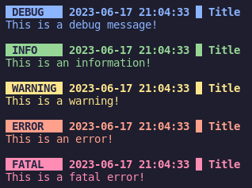

# Logger

A pretty logging library for zig.



This library depends on the [ansi](https://github.com/Remy2701/ansi) library and the [timestamp](https://github.com/Remy2701/timestamp) library (which uses libC).

## Installation

Clone this repository in your libs folder.

```sh
git clone --recursive https://github.com/Remy2701/logger
```

Then add the following line in the `build.zig`:

```zig
const logger = @import("libs/logger/build.zig");

pub fn build(b: *Build) !void {
    ...
    exe.addModule("logger", logger.module(b));
    try logger.link(exe);
}
```

## Usage

```zig
const std = @import("std");
const logger = @import("logger");

pub fn main() !void {
    // Set the log level
    logger.level = logger.Level.Debug;

    // If set to true, it will exit with 0, otherwise with 1
    logger.clean_exit = true;

    logger.debugFull("Title", .{}, "{s}", .{"This is a debug message!"});
    logger.infoFull("Title", .{}, "{s}", .{"This is an information!"});
    logger.warnFull("Title", .{}, "{s}", .{"This is a warning!"});
    logger.errFull("Title", .{}, "{s}", .{"This is an error!"});
    logger.fatalFull("Title", .{}, "{s}", .{"This is a fatal error!"});

    // Other alternatives (won't run because of the `fatalFull`)
    logger.debug("Title", .{});
    logger.info("Title", .{});
    logger.warn("Title", .{});
    logger.err("Title", .{});
    logger.fatal("Title", .{});
}
```

The ansi and timestamp libraries are also accessible from the logger module like so:
```zig
const logger = @import("logger");
const ansi = logger.ansi;
const timestamp = logger.timestamp;
```
